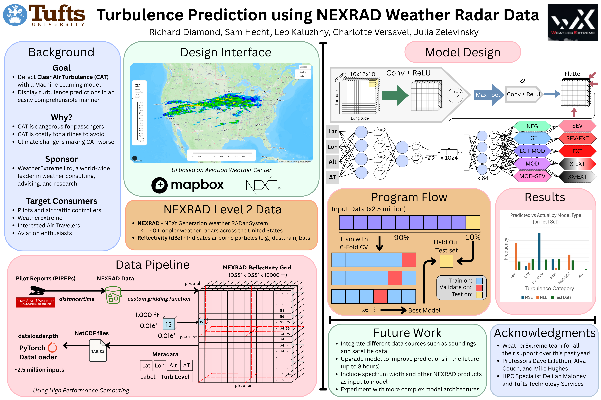

# NEXRADTurbulencePrediction

## Overview
This repository hosts code and documentation originally created in the 2024-25 academic year by a team of Tufts Students, as part of a capstone project sponsored by WeatherExtreme Ltd. The aim of the project is to build a model that predicts clear-air turbulence (CAT) and displays that information on a website with a clean user interface.

## Directories

### Model Architecture
The [Model Architecture](/model_architecture/) directory contains our model
architectures, including a hybrid model that is, as of May 2025, the best 
performing option. There are 2 forms to this hybrid model that differ very
slightly, and a regression model that we used for initial testing as well.

### Model Training
The [Model Training](/model_training/) directory contains two useful files.
One file is used for training and evaluating any of the model architectures.
This file also saves the best model it could create. The other file is used
for creating the PyTorch Dataloader which contains all the input data to the
model.

### Pilot Reports
The [Pilot Reports](/pireps) (PIREPs) directory contains useful scripts for
parsing pilot reports, which serve as our label in our machine learning models.
There are some example CSVs of PIREPs in this directory.

### Plane Weights
The [Plane Weights](/plane_weights/) directory contains useful programs for
determining the weight of planes in a pirep, and adding these weights to the
CSVs of PIREPs we have created.

### Radars
The [Radars](/radars/) directory contains useful programs for finding the
closest and most recent radar scan for any given PIREP. Then, other files in
this directory grid the reflectivity data around a PIREP and output this
data to a NetCDF file. Some scripts in [HPC Scripts](/hpc_scripts) compress
these outputs to save space for later use. These NetCDF files are ultimately
combined to serve as the inputs to our Machine Learning Model.

*Note: It's possible not all of the data in this folder was from radar scans that occurred prior to the pilot report. This was fixed later but not all data was regenerated.*

### Model Inputs
The [Model Inputs](/model_inputs/) folder contains 3 example NetCDF files that we used for training our model.
Additionally, the [README](/model_inputs/) contains a link to all of the compressed inputs we
trained our model on (found 
[here](https://drive.google.com/drive/folders/1OT9lSk_fwXce2n7T9Yg8XN_Vt4FN7rBs?usp=share_link))

### Additional Routes
The [Additional Routes](/additional_routes/) directory contains all the work we did exploring methods and datasets 
that didn't make it into our model for various reasons. Since incorporating 
the data in this folder into the model may significantly improve performance, 
all the reasons we were unable to use the data are documented, with the idea 
that if they were solved, new helpful data could be utilized.

### HPC Scripts
The [HPC Scripts](/hpc_scripts) directory contains executable files which run
the models and scripts we wrote. The executables here are meant to be run on
high-performance compute nodes. They all use SLURM and can be run with `sbatch`.

## Contacts
For any questions, you can reach out to the creators of this project:  
* Leo Kaluzhny (CS '25) - [leo.kaluzhny@gmail.com](mailto:leo.kaluzhny@gmail.com)
* Sam Hecht (CS '25) - [shechtor18@gmail.com](mailto:shechtor18@gmail.com)
* Julia Zelevinsky (CS '25) - [julia.zelevinsky@gmail.com](mailto:julia.zelevinsky@gmail.com)
* Richard Diamond (DS '25) - [richarddiamond.3@gmail.com](mailto:richarddiamond.3@gmail.com)
* Charlotte Versavel (CS '25) - [charlotteversavel21@gmail.com](mailto:charlotteversavel21@gmail.com)
