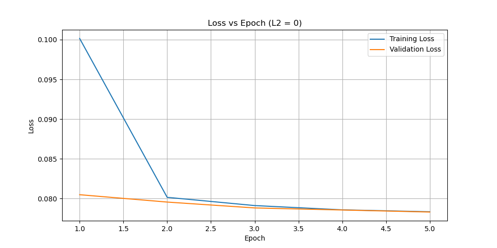

# Model Training

This directory contains the python scripts for generating a dataloader for model inputs as well as for training and testing the model on that dataloader. Sample model results and saved models are provided as well. We've also written an epoch plotting function to visualize loss across epochs.

## Creating the dataloader - [create_datasets.py](create_datasets.py) using [dataloader_class](dataloader_class.py)

[create_datasets.py](create_datasets.py) creates a dataloder.pth to be used for training and testing of any generated model using our model input type (from compressing model inputs after running [radar_data_to_model_input.py](/NEXRADTurbulencePrediction/radars/radar_data_to_model_input.py)). Includes functionality for adding to existing dataloder or starting from scratch and saves the dataloader to the specified name.

**Usage**: `python create_datasets.py <dataloader_name> [existing_dataloader]`
- dataloader_name: Desired name for dataloader to generate
- existing_dataloader: Can optionally include an existing dataloader to start with

**Dependencies**:
- [Dataloader Class](dataloader_class.py)
- [/model_inputs/compressed](/NEXRADTurbulencePrediction//model_inputs/) contains tar xz compressed model input files
**Notes**:
- Will add all compressed model inputs located in [`/model_inputs/compressed`](/NEXRADTurbulencePrediction//model_inputs/) into a dataloader.

### [dataloader_class.py](dataloader.py)
**Description**: Custom RadarDataLoader class to store all model inputs built off a PyTorch dataset.

**Usage**: `from dataloader_class import RadarDataLoader`
- Provides access to the RadarDataLoader class for use.

**Dependencies**:
- [Dataloader Class](dataloader_class.py)

**Notes**:
- We designed this class to optimize for a slower initialization but faster 'get_item` time. This meant we did the processing into features and label during initialization to be able to get fast indexing.
- Note that in order to maintain the benefits of compression, we ensure that only one compressed file is decompressed at a time.
- There are currently prints to standard output to give progress updates (specifically in the `init` function). After every 1000 inputs added to the dataloader, the total count of items added is reported.
- Currently, the dataloader fills all NaN values (undetectable reflectivity from the radar scan) with -32 dBz. This is outside the range of possible reflectivity values to represent NaN in our case. A future improvement would be to create a better fill heuristic that could better address the data sparsity concerns.

## Training and Testing the Model - [train_and_test_model.py](train_and_test_model.py)

[train_and_test_model.py](train_and_test_model.py) is the overarching python script for training and evaluating models on the HPC cluster, which is a High Performance Computing Cluster. In our project, we used the [Tufts HPC cluster](https://it.tufts.edu/high-performance-computing). `train_and_test_model.sh` can be found [here](/NEXRADTurbulencePrediction/hpc_scripts/model_training/train_and_test_model.sh).

- [train_and_test_model.sh](/NEXRADTurbulencePrediction/hpc_scripts/model_training/train_and_test_model.sh) (Bash script): Submits jobs to the cluster and allocates resources. 
- [train_and_test_model.py](train_and_test_model.py) (Python script): Trains, cross-validates, and tests models on the dataloader.

### Usage: 
This should be run using `train_and_test_model.sh` as:
`source train_and_test_model.sh [MODEL_TYPE] [SEED]`
- Example: `sbatch hpc_scripts/model_training/train_and_test_model.sh hybrid 42`

## SLURM Job Script: train_and_test_model.sh (Bash)

### Purpose

This script is designed to submit a job to the HPC cluster using the SLURM workload manager.  
It activates the necessary computing modules and environment using [`load_modules.sh`](/NEXRADTurbulencePrediction/hpc_scripts/load_modules.sh), and runs [`train_and_test_model.py`](train_and_test_model.py) with two 
arguments: 
1. model_type: Type of model to train (linear or hybrid).

2. seed: Seed for dataset split and reproducibility.

At the end, it unloads the previously loaded modules and deactivates the environment to clean up the job environment after execution.

The script and more information on utilizing the HPC can be found in the [hpc_scripts directory](/NEXRADTurbulencePrediction/hpc_scripts).

## Python Script: train_and_test_model.py (Python)
This script runs the complete machine learning pipeline, from loading and splitting the dataset to selecting and training either a linear or hybrid model. It performs hyperparameter tuning via cross-validation, supports checkpointing for resuming interrupted jobs, retrains the best model on the full training set, and evaluates performance on a hold-out test set. Finally, it saves the best-performing model for deployment.
####  Dataset Preparation

- Loads pre-saved radar dataset using specified dataloader.pth. This can be specified by changing the
`DATALOADER_PATH` variable in the script. 

- Splits into:
  - **90% training + validation**
  - **10% test set**
- Uses a seed (2nd command-line argument) for reproducibility

#### Model Choices

- `LinearClassifierModel`
- `HybridModel1Out`
- `ResNet3DModel`

Chosen dynamically via **1st** command-line arg.

#### Cross-Validation and Hyperparameter Search

- Uses `KFold` with **6 folds**, so eacb fold has 15% of the total dataset
- Searches over `L2` regularization values `[0.10, 0.01, 0.001, 0]`
- For each `L2` value:
  - Trains on 5 folds (for `NUM_EPOCHS` times)
  - Validates on 1 fold
  - Stores average loss
- After CV completes, selects L2 with lowest validation loss as the "best model"

#### Checkpointing

- Saves checkpoints during training to: `<output_dir>/<model>_<loss>_<seed>_model_checkpoint.pth`
- Stores:
  - Model and Optimizer state
  - Epoch, fold, L2 index (in `[0.10, 0.01, 0.001, 0]`)
  - Loss history prior to interruption
- Allows seamless resuming if job is interrupted

#### Retraining on Full Training Data
- Once best L2 is chosen, re-initializes and trains model on full 90% training and validations dataset.
- Trains for 5 epochs to maximize performance using all available data.

#### Final Testing and Evaluation
- Tests retrained model on hold-out test set (10%).

- Collects and prints:

  - Accuracy

  - False Positive Rate

  - False Negative Rate

  - Actual vs Predicted Class Distributions

- Saves final model as `trained_model_outputs/<timestamp>_best_<model_type>_<loss>_model_w_seed_<SEED>.pth`
- Saves final results as `trained_model_outputs/<timestamp>_best_<model_type>_<loss>_model_w_seed_<SEED>_results.txt`

[trained_model_outputs](./trained_model_outputs/) contains two example models and their corresponding results file. 

## Epoch Plotting - [plot_epochs](plot_epochs.py)

For visualizing the loss over epochs under different l2 configurations, we've porvided a plotting function. This can be used to generate plots (as shown in [epoch_plots](./epoch_plots/)) and like the example below. The produced epoch plots can help determine if the model is overfitting

## Works in Progress
We began exploring two additional paths: using the model to predict on new data, and training the model to produce output better suited for a heatmap display.

### Prediction
Three paths were attempted for using the model to make predictions:
1. [predict_from_csv.py](predict_from_csv.py)

2. [predict_radar_conus.py](predict_radar_conus.py)

3. [predict_radar_demo.py](predict_radar_demo.py)

See their associated file headers for descriptions of each and their usage. There are hpc scripts to run 2 and 3 as jobs. These can be found at [hpc_scripts/model_training predict_conus.sh and predict_radar_demo.sh](/NEXRADTurbulencePrediction/hpc_scripts/model_training/). Note that all three of these paths are works in progress, predict_radar_conus was the most successfull but was having memory issues (it would often get OOM killed). This could potentially be fixed by adjusting how the caching works, but we unfortunately ran out of time. 

### Visualization
We made a file to generate a geojson from the model's predictions [export_predictions_geojson.py](export_predictions_geojson.py), which is fully functioning for the dot-based display. Note that this file will most likely need to be adjusted should the display want to be changed to a heatmap image instead (which is recommended).

### Heatmap Model
[train_heatmap.py](train_heatmap.py) is an attempt to train a model that can output results better suited for a heatmap image display rather than a dot display. We realized that our standard way of training the model wouldn't product the range of predictions needed to accurate display results as a heatmap. It was just able to predict "severe or not severe" rather than a whole spectrum of turbulence levels. We were not able to successfully get this heatmap model running though.

The model can be run through the [train_and_test_model.sh](/NEXRADTurbulencePrediction/hpc_scripts/model_training/train_and_test_model.sh) by providing "heatmap" as the model type.
Example: `sbatch train_and_test_model.sh heatmap 42`
